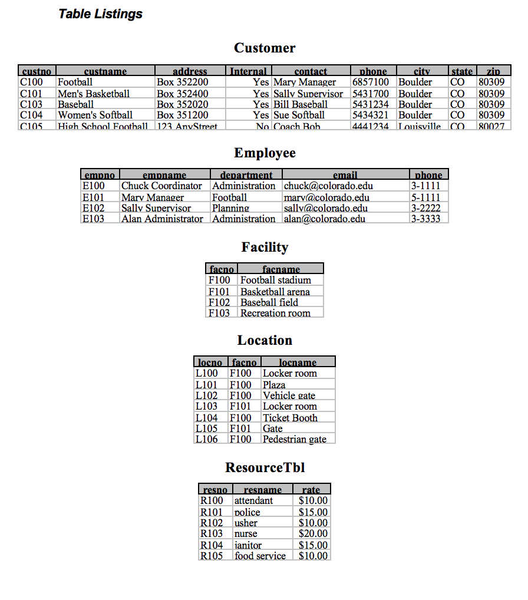
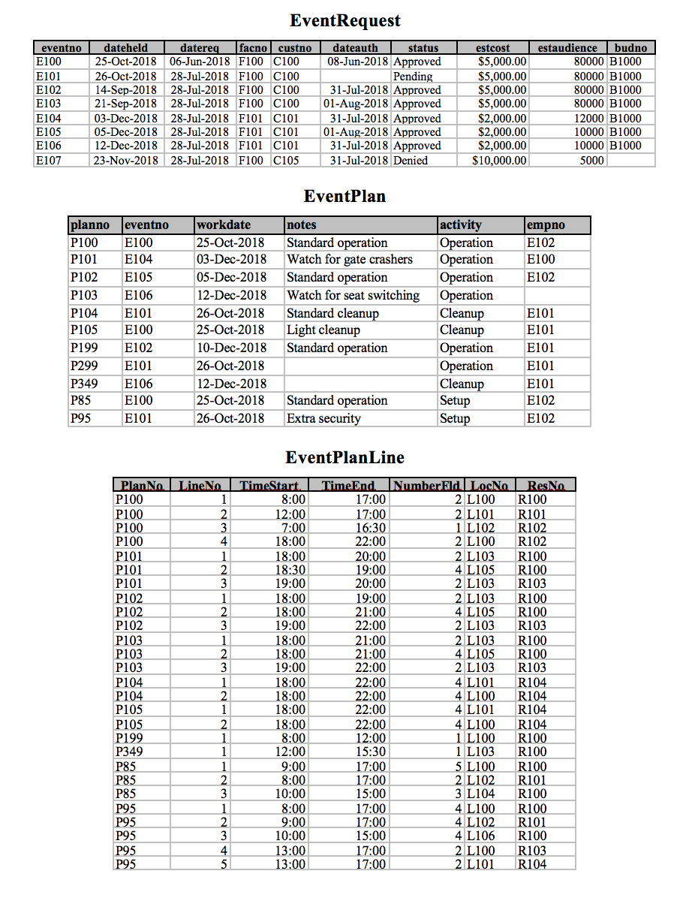
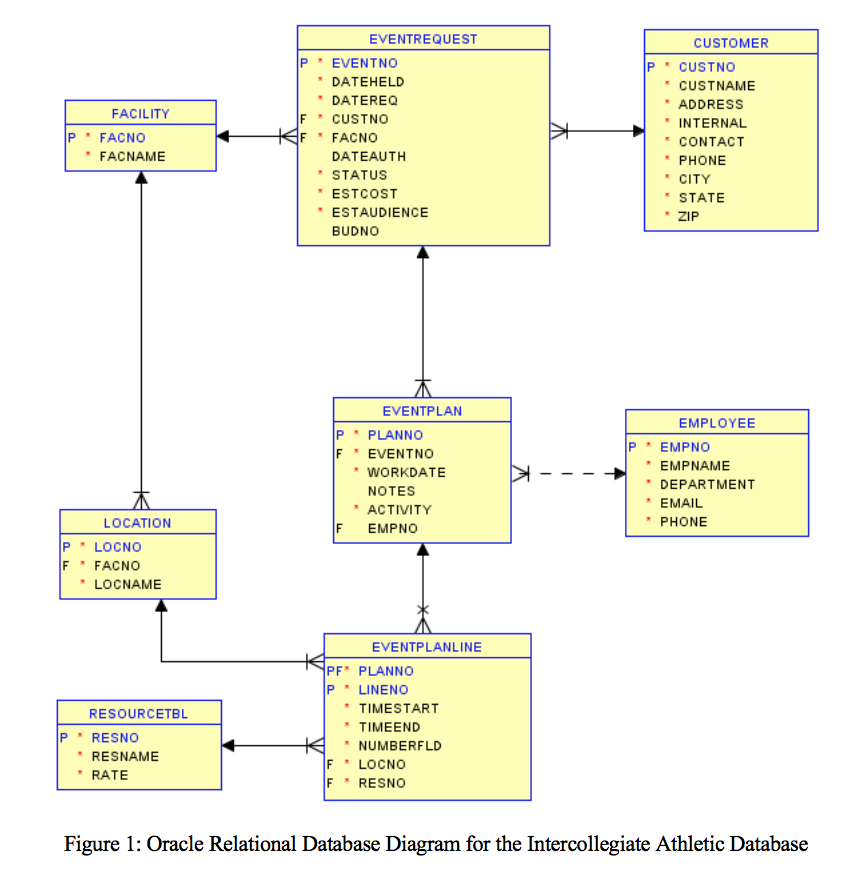

# ICA Diagrams

`Tables1.png` and `Tables2.png` contain all tables used in the Intercollegiate Athletic Database.

`ERD.png` contains an Entity Relationship Diagram illustrating the relationships between these tables.

These files are referenced throughout modules 3, 4, and 5.

## Tables1

## Tables2

## ERD

