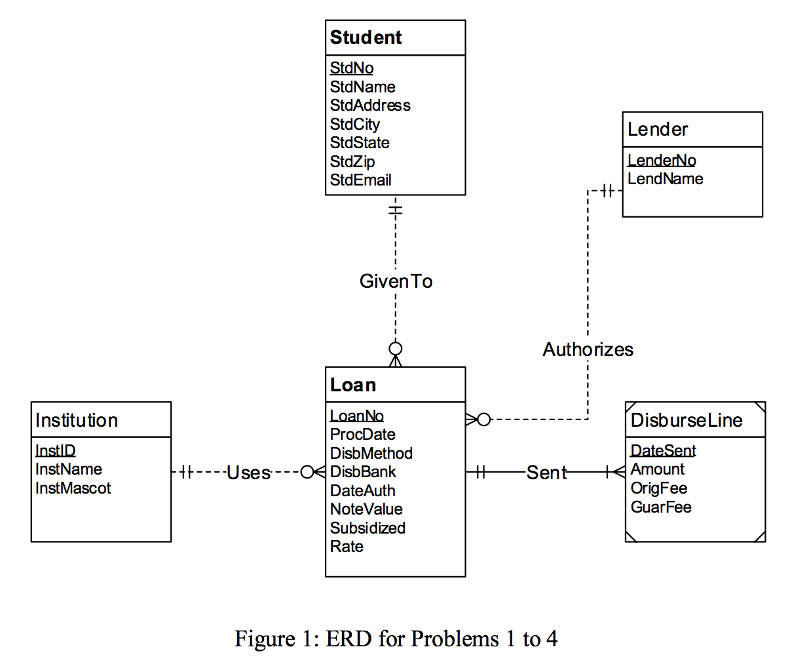
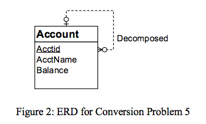
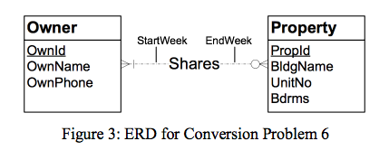

# Module 10

## Key Lessons

This module primarily taught:

 1. Logical database design is the part of the design phase where you implement your Conceptual Data Model (as an ERD) into a DBMS as a conceptual table design.
 2. The first step of this design process (Module 10) is conversion from an ERD to a table design.
 3. The second step of this design process (Module 11) is the remaining three steps:

 - Specify: Apply redundancy constraints to tables
 - Normalize: Eliminate unwanted redundancies
 - Refine: Apply other constraints such as unique constraints

The 4 Conversion Rules:

1. Primary key of non-weak entity types become primary key of the table, and attributes become columns of the table
2. One-to-Many relationships convert relationships into foreign keys (placed in the child table)
3. Many-to-Many relationships are converted with the relationship attributes converting into the columns of the table. The relationship becomes the name of the table. The resulting table has a primary key combined of the primary keys of the two connecting tables. Each of those primary keys are also foreign keys in the middle table.
4. When converting weak entities into tables, its primary key becomes the combination of its own primary key, as well as the primary keys of the tables in its identifying relationship.

## Practice Problems

## Graded Assignment

Problems 1-4 Reference Figure 1 below. Primary keys listed in the following problems are defined in **Bold**, foreign keys are defined in *Italics.*

### Problem 1

For the ERD in Figure 1, you should indicate the applications of the entity type rule. For each entity type rule application, you should identify the table name, primary key, and other columns. You do not need to write CREATE TABLE statements.

Student(**StdNo**, StdName, StdAddress, StdCity, StdState, StdZip, StdEmail)
- Table Name: Student
- Primary Key: StdNo
- Columns: Attributes listed

Loan(**LoanNo**, ProcDate, DisbMethod, DisbBank, DateAuth, NoteValue, Subsidized, Rate)
- Table Name: Loan
- Primary Key: LoanNo
- Columns: Attributes listed

Institution(**InstID**, InstName, InstMascot)
- Table Name: Institution
- Primary Key: InstID
- Columns: Attributes listed

Lender(**LenderNo**, LendName)
- Table Name: Lender
- Primary Key: LenderNo
- Columns: Attributes listed

### Problem 2

For the ERD in Figure 1, you should indicate applications of the 1-M relationship rule. For each 1-M relationship rule application, you should indicate the changes to the tables you listed in problem 1 including foreign key columns and NOT NULL constraints for foreign keys if necessary.

Loan(**LoanNo**, *StdNo*, *LenderNo*, *InstID*, ProcDate, DisbMethod, DisbBank, DateAuth, NoteValue, Subsidized, Rate)
- FOREIGN KEY(*StdNo*) REFERENCES Student
- FOREIGN KEY(*LenderNo*) REFERENCES Lender
- FOREIGN KEY(*InstID*) REFERENCES Institution
- StdNo NOT NULL
- LenderNo NOT NULL
- InstID NOT NULL

### Problem 3

For the ERD in Figure 1, you should indicate applications of the M-N relationship rule. For each M-N relationship rule application, you should list the table name, primary key, and other columns.

There are **NONE.**

### Problem 4

4.	For the ERD in Figure 1, you should indicate applications of the identifying relationship rule. For each identifying relationship rule application, you should indicate the changes to the tables you listed in problem 2.

DisburseLine(**DateSent**, ***LoanNo***, Amount, OrigFee, GuarFee)
- FOREIGN KEY(*LoanNo*) REFERENCES Loan
- LoanNo NOT NULL

I altered the weak entity DisburseLine into its own table. Its primary key is a combination of **DateSent** and **LoanNo.**

### Problem 5

Convert the ERD shown in Figure 2 into tables. List the conversion rules used and table design. For each table, you should list the primary key, foreign keys, other columns, and NOT NULL constraints for foreign keys if necessary. You do not need to write CREATE TABLE statements.

The following table conversion uses the Entity Type Rule and the 1-M Rule.

Account(**Acctid**, AcctName, Balance, *Decomposed*)
- Primary Key: Acctid
- FOREIGN KEY(*Decomposed*) REFERENCES Account
- Columns: Attributes listed

### Problem 6

Convert the ERD shown in Figure 3 into tables. List the conversion rules used and table design. For each table, you should list the primary key, foreign keys, other columns, and NOT NULL constraints for foreign keys if necessary. You do not need to write CREATE TABLE statements.

The following table conversion uses the Entity Type Rule and the M-N Rule.

Owner(**OwnId**, OwnName, OwnPhone)
- Primary Key: OwnId

Property(**PropId**, BldgName, UnitNo, Bdrms)
- Primary Key: PropId

Shares(***PropId***, ***OwnId***, StartWeek, EndWeek)
- Primary Key: PropId and OwnId
- FOREIGN KEY(*PropId*) REFERENCES Property
- FOREIGN KEY(*OwnId*) REFERENCES Owner
- Columns: Attributes listed
