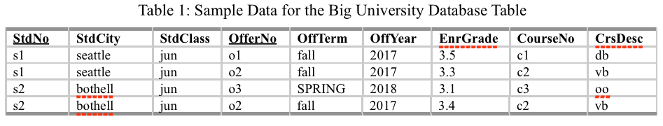
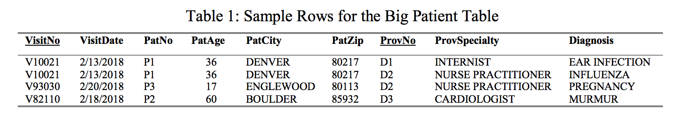
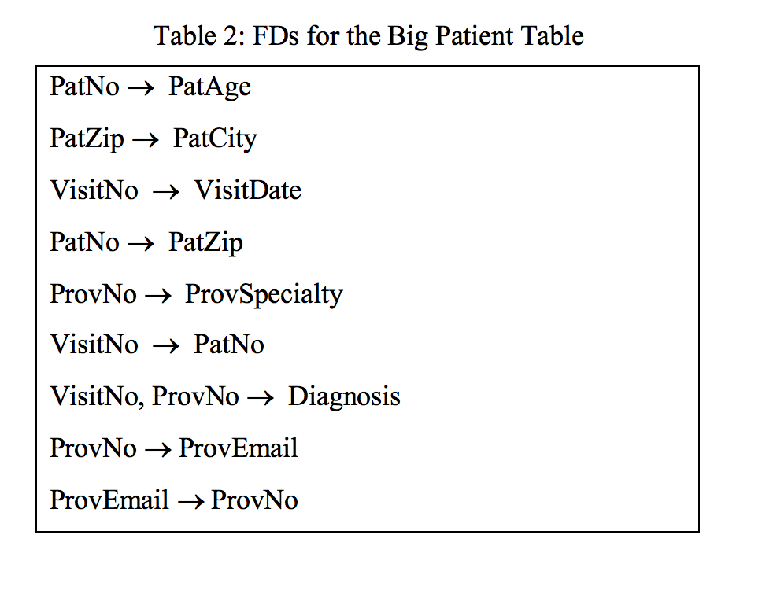
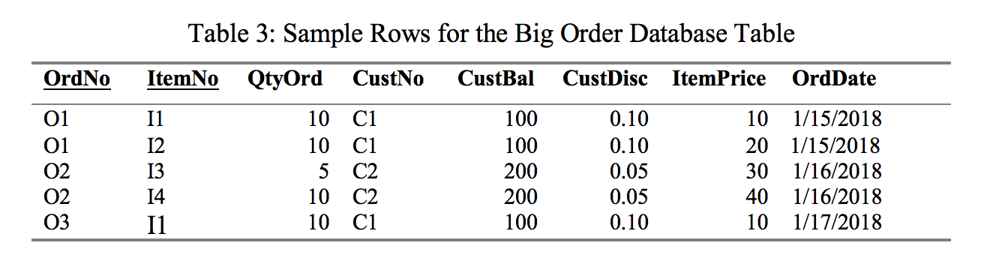

# Module 11

## Key Lessons

This module primarily taught:

 1. Modification anomalies

- Modification anomalies are unwanted side effects from insertion, update, and delete statements.
- This is the motivation to normalize data and reduce redundancy in table design.
 
 2. Functional Dependencies

- Identifying Functional Dependencies is an important part of normalization.
- A functional dependency is similar to a unique constraint. It specifies a column or set of columns that determines uniqueness of other columns. It has X columns, or determinant (LHS) columns on the left, and Y (RHS) columns on the right. When combined, all X columns should determine the values of Y columns.
- Falsifying functional dependencies means proving a functional dependency is false by inspecting rows in a table.

3. Normal Forms

- Boyce Cod Normal Form (BCNF) requires that every determinant of a functional dependency must be unique in a table.
- BCNF Procedure to Normalize tables includes grouping functional dependencies with the same LHS. Then, we define tables for each group, using the determinant as the primary key and adding foreign keys. Last, we merge tables if the columns of one table are a subset of the columns of another table.

Normalization is more important for transaction processing, but not for business intelligence. Denormalization may actually improve business intelligence queries because we do not have to `JOIN` as many tables.

## Practice Problems

### Problem 1

For the big university database table, list FDs with the column StdCity as the determinant that are falsified by sample rows. For each FD, you should identify one falsification example or indicate that no falsification example exists in the sample rows. Remember that it takes two rows to falsify an FD in which the LHS is the same in both rows but the RHS is different.

|Functional Dependencies|Falsifying Rows  |
|--|--|
|StdCity -> StdNo    |None|
|StdCity -> StdClass|None|
|StdCity -> OfferNo|(1, 2), (3, 4)|
|StdCity -> OffTerm|(3, 4)|
|StdCity -> OffYear|(3, 4)|
|StdCity -> EnrGrade|(1, 2), (3, 4)|
|StdCity -> CourseNo|(1, 2), (3, 4)|
|StdCity -> CrsDesc|(1, 2), (3, 4)|

### Problem 2

You should add one or more sample rows to Table 1 for the FDs in problem 1 with no falsification example. For each non falsified FD with _StdCity_ as the determinant, you should add one or more sample rows and then identify a falsification example involving the new row(s) and rows from Table 1.

A new row may be added to Table 1
|StdNo|StdCity|StdClass|OfferNo|OffTerm|OffYear|EnrGrade|CourseNo|CrsDesc|
|--|--|--|--|--|--|--|--|--|
|s3|seattle|soph|o1|fall|2013|3.2|c1|db|

Using the new row above (row 5), we have a falsification of the two functional dependencies in Problem 1 that are not yet falsified. The following are the falsifying rows with the new added fifth record.

|Functional Dependencies|Falsifying Rows  |
|--|--|
|StdCity -> StdNo|(1, 5), (2, 5)|
|StdCity -> StdClass|(1, 5), (2, 5)|

### Problem 3

1.  Apply the simple BCNF procedure to the following list of FDs. Show the result of each step. In the final list of tables, you should show the primary keys, foreign keys, and unique constraints. You do not need to write CREATE TABLE statements.

AuthNo → AuthName
AuthEmail → AuthNo
PaperNo →  Primary-AuthNo
AuthNo → AuthAddress
AuthNo → AuthEmail
PaperNo →  PapTitle
PaperNo →  PapAbstract
PaperNo →  PapStatus
RevNo → RevName
RevNo → RevEmail
RevEmail → RevNo
RevNo, PaperNo  →  Auth-Comm
RevNo, PaperNo  →  Prog-Comm
RevNo, PaperNo  →  RevDate
RevNo, PaperNo  →  Rating
RevNo → RevAddress

Steps of BCNF Normalization Process:

1. Group FDs with the same determinant (LHS)

AuthNo -> AuthName, AuthEmail, AuthAddress
AuthEmail -> AuthNo
PaperNo -> Primary-AuthNo, PapTitle, PapAbstract, PapStatus
RevNo -> RevName, RevEmail, RevAddress
RevEmail -> RevNo
RevNo, PaperNo -> Auth-Comm, Prog-Comm, RevDate, Rating

2. Create Tables using Determinant as primary key, adding foreign keys where necessary (**Bold** indicates primary key, *Italics* indicates foreign key)

- Author(**AuthNo**, AuthName, *AuthEmail*, AuthAddress)
FOREIGN KEY (*AuthEmail*) REFERENCES AuthorEmail
- AuthorEmail(**AuthEmail**, *AuthNo*)
FOREIGN KEY (*AuthNo*) REFERENCES Author
- Paper(**PaperNo**, *Primary-AuthNo*, PapTitle, PapAbstract, PapStatus)
FOREIGN KEY (*Primary-AuthNo*) REFERENCES Author
- Reviewer(**RevNo**, RevName, *RevEmail*, RevAddress)
FOREIGN KEY(*RevEmail*) REFERENCES ReviewerEmail
- ReviewerEmail(**RevEmail**, *RevNo*)
FOREIGN KEY (*RevNo*) REFERENCES Reviewer
- Review(***RevNo***, ***PaperNo***, Auth-Comm, Prog-Comm, RevDate, Rating)
FOREIGN KEY (*RevNo*) REFERENCES Reviewer
FOREIGN KEY (*PaperNo*) REFERENCES Paper

3. Merge tables if one contains columns that are a subset of another table

Through this process we can remove the following tables:
- ReviewerEmail
- AuthorEmail

We can also remove the foreign key constraints on the other table definitions that reference these tables, as well as add additional UNIQUE constraints as required, resulting in our normalized list of final tables:

- Author(**AuthNo**, AuthName, AuthEmail, AuthAddress)
UNIQUE AuthEmail
- Paper(**PaperNo**, *Primary-AuthNo*, PapTitle, PapAbstract, PapStatus)
FOREIGN KEY (*Primary-AuthNo*) REFERENCES Author
- Reviewer(**RevNo**, RevName, RevEmail, RevAddress)
UNIQUE RevEmail
- Review(***RevNo***, ***PaperNo***, Auth-Comm, Prog-Comm, RevDate, Rating)
FOREIGN KEY (*RevNo*) REFERENCES Reviewer
FOREIGN KEY (*PaperNo*) REFERENCES Paper

## Graded Assignment

### Problem 1

1. You should identify insertion, update, and deletion anomalies in the sample rows of the big patient table shown in Table 1. You should identify one example of each type of anomaly. The combination of *VisitNo* and *ProvNo* is the only unique column(s) for the table.

Insertion Anomaly: Adding a new patient into the database requires that we add a visit date, as well as provider information and the diagnosis for that visit. This is extra information that most likely is not useful if we simply want to add a new patient into the database.

Update Anomaly: If we need to update the age of the patient, we will utilize extra resources because we need to update the age of the patient in all rows with the corresponding PatNo. In this table, if we need to increase the age of the patient with PatNo = 1, we need to update rows 1 and 2.

Deletion Anomaly: We may need to delete the records of the patient with PatNo = 1. To do this, we must delete the associated visits they had, as well as the diagnoses performed. This could be undesired if we still want to see which providers performed which diagnoses on which dates, regardless of the patients involved.

### Problem 2

Apply the simple BCNF procedure to define BCNF  tables using the FD list Table 2. Show the result of each step in your analysis. For the final result, you should show the tables, columns, primary key of each table, foreign keys, and unique constraints. You do not need to provide CREATE TABLE statements.

Steps of BCNF Normalization Process:

1. Group FDs with the same determinant (LHS)

PatNo -> PatAge, PatZip
PatZip -> PatCity
VisitNo -> VisitDate, PatNo
ProvNo -> ProvSpecialty, ProvEmail
VisitNo, ProvNo -> Diagnosis
ProvEmail -> ProvNo

2. Create Tables using Determinant as primary key, adding foreign keys where necessary (**Bold** indicates primary key, *Italics* indicates foreign key)

- Patient(**PatNo**, PatAge, *PatZip*)
FOREIGN KEY (*PatZip*) REFERENCES Zip
- Zip(**PatZip**, PatCity)
- Visit(**VisitNo**, VisitDate, *PatNo*)
FOREIGN KEY (*PatNo*) REFERENCES Patient
- Provider(**ProvNo**, ProvSpecialty, *ProvEmail*)
FOREIGN KEY (*ProvEmail*) REFERENCES ProviderEmail
- Appointment(***VisitNo***, ***ProvNo***, Diagnosis)
FOREIGN KEY (*VisitNo*) REFERENCES Visit
FOREIGN KEY (*ProvNo*) REFERENCES Provider
- ProviderEmail(**ProvEmail**, *ProvNo*)
FOREIGN KEY (*ProvNo*) REFERENCES Provider

3. Merge tables if one contains columns that are a subset of another table

Through this process we can only remove the ProviderEmail table. We can also remove the foreign key constraints on the other table definitions that reference these tables, as well as add additional UNIQUE constraints as required, resulting in our normalized list of final tables:

- Patient(**PatNo**, PatAge, *PatZip*)
FOREIGN KEY (*PatZip*) REFERENCES Zip
- Zip(**PatZip**, PatCity)
- Visit(**VisitNo**, VisitDate, *PatNo*)
FOREIGN KEY (*PatNo*) REFERENCES Patient
- Provider(**ProvNo**, ProvSpecialty, ProvEmail)
UNIQUE ProviderEmail
- Appointment(***VisitNo***, ***ProvNo***, Diagnosis)
FOREIGN KEY (*VisitNo*) REFERENCES Visit
FOREIGN KEY (*ProvNo*) REFERENCES Provider

### Problem 3

For the big order database table in Table 3, you should list FDs with the column *OrdNo* as the determinant. For each FD, you should identify at least one pair of sample rows that falsify it or indicate that no falsification example exists for the FD. Remember that it takes two rows to falsify an FD in which the LHS is the same in both rows, but the RHS is different in both rows.

|Functional Dependencies|Falsifying Rows  |
|--|--|
|OrdNo -> ItemNo|(1, 2), (3, 4)|
|OrdNo -> QtyOrd|(3, 4)|
|OrdNo -> CustNo|None|
|OrdNo -> CustBal|None|
|OrdNo -> CustDisc|None|
|OrdNo -> ItemPrice|(1, 2), (3, 4)|
|OrdNo -> OrdDate|None|
