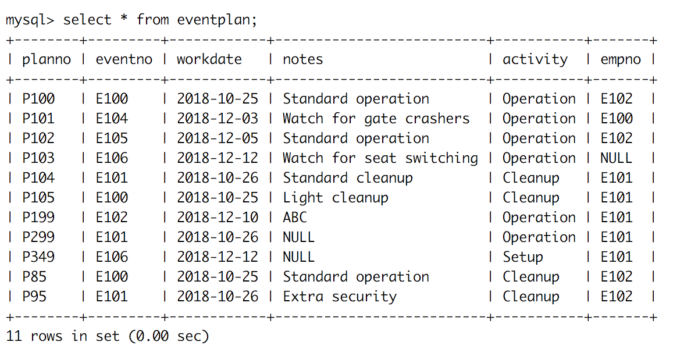

# Module 3

## Key Lessons

This module primarily taught:

 1. How to use `CREATE TABLE` statement
 2. How to create primary and foreign key constraints both inline and as external constraints.
 3. Entity Integrity: Each table (entity) must have a column or combination of columns used to identify its primary key.
 4. Referential Integrity: Column values in one table that reference another table match the related column values in the referenced table.

## Practice Problems

All practice problems with the answers are located in `practice_problems.sql` and cover `CREATE TABLE` statements in MySQL for 3 of the 7 tables in the ICA database.

## Graded Assignment

The graded assignment for module 3 was to finish the remaining 4 tables for the ICA database not covered in the practice problems. All `CREATE TABLE` statements are located in `graded_assignment.sql`. I have uploaded images of Terminal illustrating my success in creating the necessary tables, located in the `images` directory. Each image is listed below.

### Customer

### Employee

### Event Plan

### Event Plan Line

### Event Request

### Facility

### Location

### Resource Tbl

