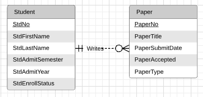
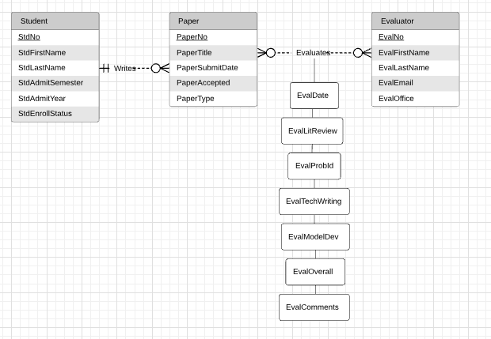
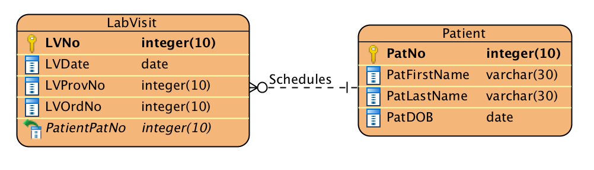
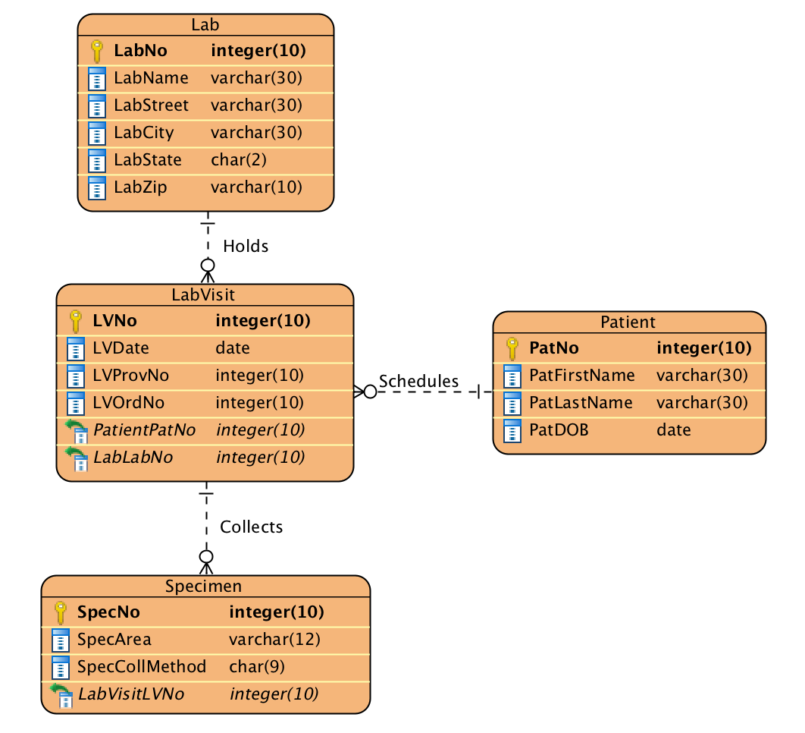

# Module 6

## Key Lessons

This module primarily taught:

 1. Basic ERD Notation for: Entity types, relationships, attributes, primary keys, cardinalities
 2. Different types of relationships among entities including: One-to-one, one-to-many, many-to-many, etc.
 3. Weak vs. Strong entities: A weak entity is one that is dependent on its identifying relationship (it needs another entity to identify itself). A strong entity is a non-weak entity.
 4. There are different types of notations for ERDs, as there is no set standard.

## Practice Problems

### Problem 1
Draw an ERD containing Student and Paper entity types connected by a 1-M relationship. The Student entity type should have the following attributes:

 - StdNo (primary key)
 - StdFirstName
 - StdLastName
 - StdAdmitSemester
 - StdAdmitYear
 - StdEnrollStatus (full or part-time).

The Paper entity type should have the following attributes:

 - PaperNo (primary key)
 - PaperTitle
 - PaperSubmitDate
 - PaperAccepted (yes or no)
 - PaperType (first, second, proposal, or dissertation)

Add a 1-M relationship from Student to Paper.

### Problem 2

Extend the ERD with an Evaluator entity type and an M-N relationship between Paper and Evaluator. The Evaluator entity type should have the following attributes:

 - EvalNo (primary key)
 - EvalFirstName
 - EvalLastName
 - EvalEmail
 - EvalOffice

The M-N relationship should have the following attributes:

 - EvalDate
 - EvalListReview (1 to 5 rating)
 - EvalProbId (1 to 5 rating)
 - EvalTechWriting (1 to 5 rating)
 - EvalModelDev (1 to 5 rating)
 - EvalOverall (1 to 5 rating)
 - EvalComments

 

### Problem 3

Transform the M-N relationship from *Problem 2* into an associative entity type and identifying relationships.

## Graded Assignment

### Problem 1

Draw an ERD containing the LabVisit and Patient entity types connected by a 1-M relationship from Patient to LabVisit. Choose an appropriate relationship name using your common knowledge of interactions between patients and lab visits. Define minimum cardinalities so that a patient is required for a lab visit. For the Patient entity type include the following attributes:

 - PatNo (primary key)
 - PatLastName
 - PatFirstName
 - PatDOB (date of birth)

For the LabVisit entity type include the following attributes:

 - LVNO (primary key)
 - LVDate
 - LVProvNo
 - LVOrdNo (for orders from physicians) (optional)

If you are using a data modeling tool that supports data type specification, choose appropriate data types for the attributes based on your common knowledge.

### Problem 2
Extend problem 1 with the Lab entity type connected by a 1-M relationship from Lab to LabVisit. Choose an appropriate relationship name using your common knowledge of interactions between labs and lab visits. Define minimum cardinalities so that a lab is required for a lab visit. For the Lab entity type including the following attributes:

 - LabNo (primary key)
 - LabName
 - LabStreet
 - LabCity
 - LabState
 - LabZip

If you are using a data modeling tool that supports data type specification, choose appropriate data types for the attributes based on your common knowledge.

### Problem 3

Augment your ERD from problem 2 with the Specimen entity type. For each specimen collected, the database should record a unique SpecNo, SpecArea (vaginal, cervical, or endocervical), and SpecCollMethod (thin prep or sure path). You should also add a 1-M relationship from LabVisit to Specimen. A lab visit must produce at least one specimen. A specimen is associated with exactly one lab visit.

