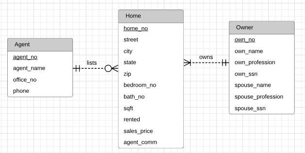
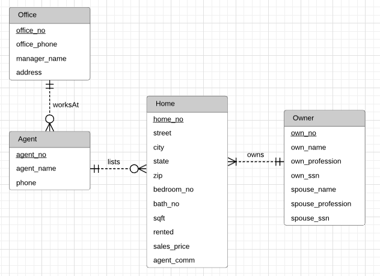
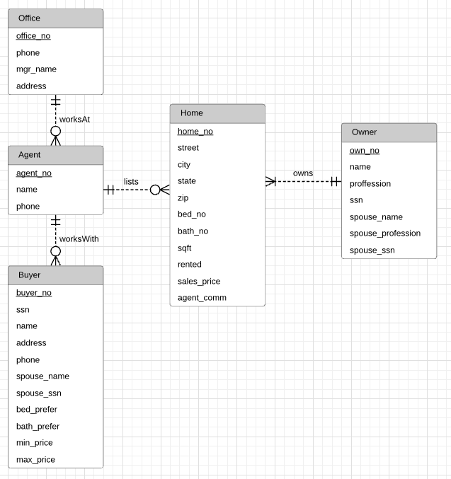
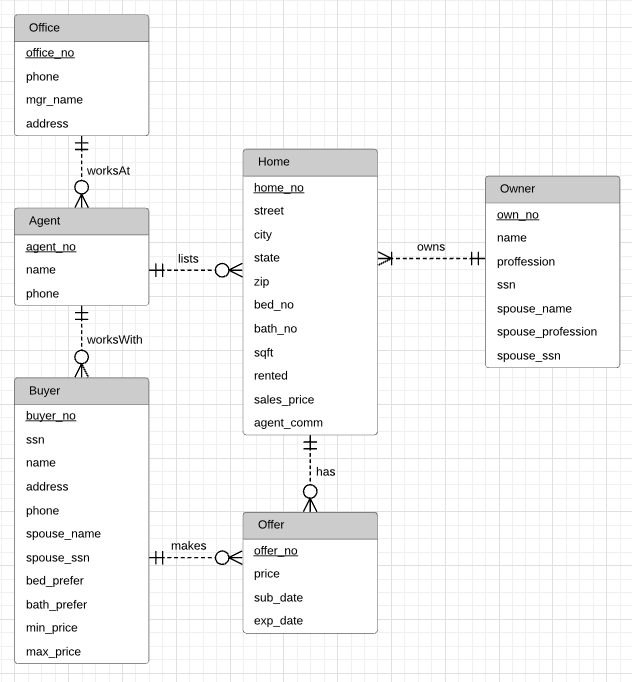
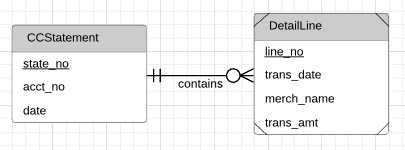
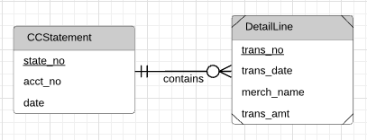
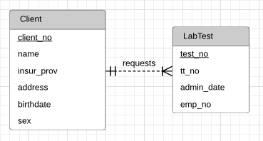
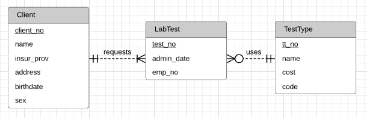
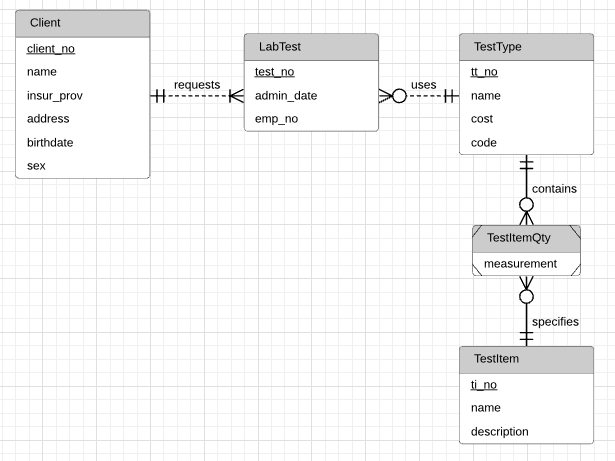

# Module 8

## Key Lessons

This module primarily taught:

1. How to analyze a narrative to build an ERD

- Have a bias towards simpler design, and get more complex as needed.
- Look for nouns as possible entity candidates, with any details about those nouns as attributes.
- Primary keys should be stable and single purpose, but are typically best represented by integer values automatically generated by a DBMS.

2. Data modeling is an iterative/repetitive process, and you should spend time generating and evaluating alternative designs, especially for larger databases. The following are some examples of data transformations:

- Attribute Expansion: Providing more detail on a specific attribute by replacing it with an entity type.
- Split Compounded Attributes: Splitting an attribute into several other attributes within the same entity (ex: address -> state, city, and zip)
- Entity Type Expansion: Converts one entity type into two more defined entity types. (Similar to attribute expansion, but we are breaking down the concept behind the entity rather than a specific attribute)
- Change weak entity into a strong one and remove identifying relationships (least used transformation)

3. Extended examples of transformation by keeping track of History and Reverse Transformations

- Attribute History Transformation: Expanding an entity typically into an associative entity type and a pair of identifying relationships to keep track of the entity's history (ex: expanding Employee to Employee and Title History listing previously held positions)
- Limited Attribute History Transformation: In a situation where you only want a limited history, you can simply add any number of attributes to the entity (ex: expanding EmployeeTitle to CurrTitle and PrevTitle)
- Reverse Transformations: Any of the transformations discussed can be reversed if attempting to simplify a design.

## Practice Problems

### Problem 1

Define an ERD for the following narrative. The database should track homes and owners. A home has a unique home identifier, a street address, a city, a state, a zip, a number of bedrooms, a number of bathrooms, and square feet. A home is either owner occupied or rented. An owner has a unique owner number, a Social Security number (used for government reporting requirements), a name, an optional spouse name, a profession, an optional spouse profession, and an optional spouse Social Security number. An owner can possess one or more homes. Each home has only one owner.

### Problem 2

Refine the ERD from problem 1 by adding an agent entity type. Agents represent owners in the sale of a home.  An agent can list many homes, but only one agent can list a home. An agent has a unique agent identifier, a name, an office identifier, and a phone number. When an owner agrees to list a home with an agent, a commission (percentage of the sales price) and a selling price are determined.

### Problem 3

In the ERD from problem 2, transform the attribute, office identifier, into an entity type. Data about an office include the phone number, the manager name, and the address.

### Problem 4

In the ERD from problem 3, add a buyer entity type. A buyer entity type has a unique buyer identifier, a Social Security number (used for government reporting only), a name, an address, a phone number, optional spouse attributes (name and Social Security number), and preferences for the number of bedrooms and bathrooms, and a price range. An agent can work with many buyers, but a buyer works with only one agent. 

### Problem 5

Revise the ERD from problem 4 by adding an offer entity type. A buyer makes an offer on a home for a specified sales price. The offer starts on the submission date and time and expires on the specified date and time. A unique offer number identifies an offer. A buyer can submit multiple offers for the same home.

### Problem 6

Design an ERD to represent a credit card statement. The statement has two parts: a heading containing the unique statement number, the account number of the credit card holder, and the statement date; and a detail section containing a list of zero or more transactions for which the balance is due. Each detail line contains a line number, a transaction date, a merchant name, and the amount of the transaction. The line number is unique within a statement.

### Problem 7

Modify your ERD from problem 6. Everything is the same except that each detail line contains a unique transaction number in place of the line number. Transaction numbers are unique across statements.

## Graded Assignment

### Problem 1

Draw an ERD to track lab tests performed by a medical laboratory on clients. The database should track basic client details including a unique client identifier, client name, client insurance provider (if any), client address, client date of birth, and client sex. The database should track the unique identifier for a lab test, the test type identifier, the date and time when the lab test was administered, and the identifier of the lab employee performing the test. A client can request multiple tests in a visit to the lab. The database only contains clients who have had lab tests performed. Each lab test is administered to one client.

### Problem 2

Revise the ERD from problem 1 with more details about test types. A test type includes a unique test type identifier, a test type name, a test type cost, and a test type code. A lab test administered to a client is associated with one test type. A test type can be administered to multiple clients. A test type can exist in the database without ever being administered.

### Problem 3

Revise the ERD from problem 2 with test type items. A test type item includes a unique test item identifier, a test item name, test item unit of measure, and a test item description. A test type includes one or more test items. A test item can be part of one or more test types. Do not use an M-N relationship.

### Problem 4

Revise the ERD from problem 3 to use an M-N relationship. 

