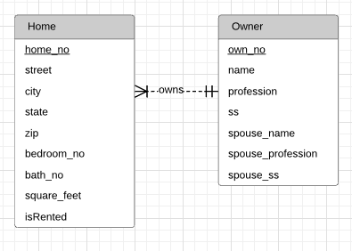

# Module 7

## Key Lessons

This module primarily taught:

1. How to analyze a narrative to build an ERD

- Have a bias towards simpler design, and get more complex as needed.
- Look for nouns as possible entity candidates, with any details about those nouns as attributes.
- Primary keys should be stable and single purpose, but are typically best represented by integer values automatically generated by a DBMS.

2. Data modeling is an iterative/repetitive process, and you should spend time generating and evaluating alternative designs, especially for larger databases. The following are some examples of data transformations:

- Attribute Expansion: Providing more detail on a specific attribute by replacing it with an entity type.
- Split Compounded Attributes: Splitting an attribute into several other attributes within the same entity (ex: address -> state, city, and zip)
- Entity Type Expansion: Converts one entity type into two more defined entity types. (Similar to attribute expansion, but we are breaking down the concept behind the entity rather than a specific attribute)
- Change weak entity into a strong one and remove identifying relationships (least used transformation)

3. Extended examples of transformation by keeping track of History and Reverse Transformations

- Attribute History Transformation: Expanding an entity typically into an associative entity type and a pair of identifying relationships to keep track of the entity's history (ex: expanding Employee to Employee and Title History listing previously held positions)
- Limited Attribute History Transformation: In a situation where you only want a limited history, you can simply add any number of attributes to the entity (ex: expanding EmployeeTitle to CurrTitle and PrevTitle)
- Reverse Transformations: Any of the transformations discussed can be reversed if attempting to simplify a design.

## Practice Problems

### Problem 1

Define an ERD for the following narrative. The database should track homes and owners. A home has a unique home identifier, a street address, a city, a state, a zip, a number of bedrooms, a number of bathrooms, and square feet. A home is either owner occupied or rented. An owner has a unique owner number, a Social Security number (used for government reporting requirements), a name, an optional spouse name, a profession, an optional spouse profession, and an optional spouse Social Security number. An owner can possess one or more homes. Each home has only one owner.

### Problem 2

Refine the ERD from problem 1 by adding an agent entity type. Agents represent owners in the sale of a home.  An agent can list many homes, but only one agent can list a home. An agent has a unique agent identifier, a name, an office identifier, and a phone number. When an owner agrees to list a home with an agent, a commission (percentage of the sales price) and a selling price are determined.

### Problem 3

### Problem 4

## Graded Assignment

