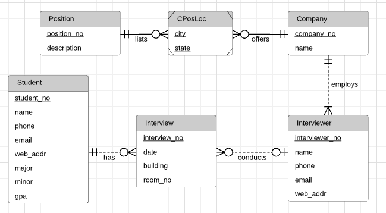
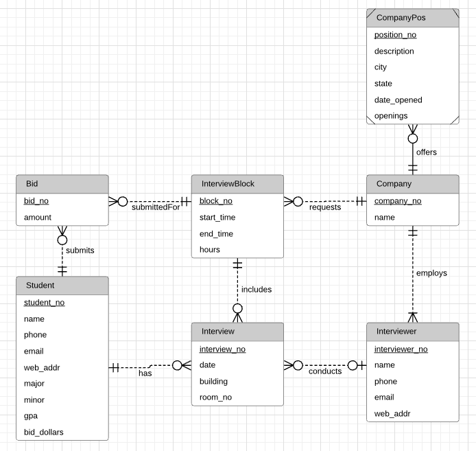
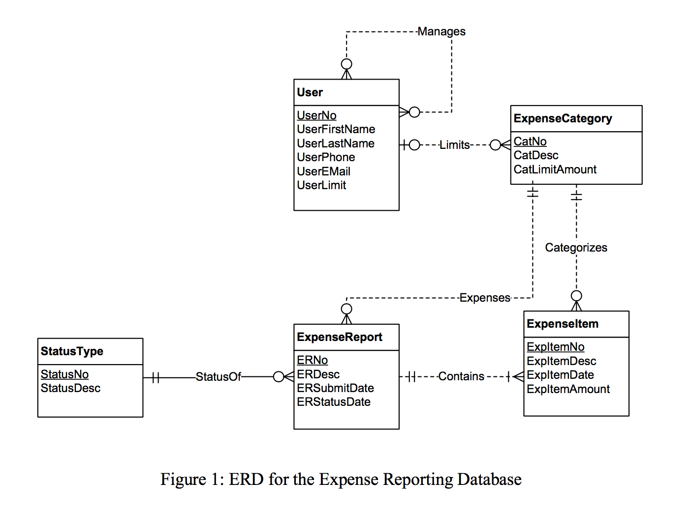
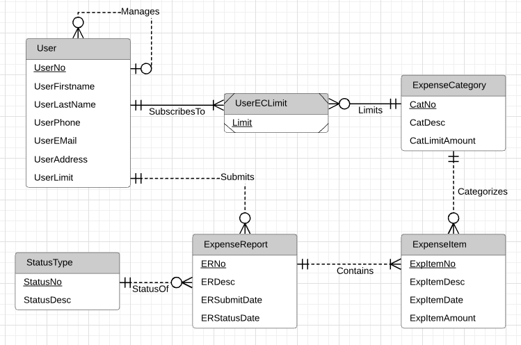
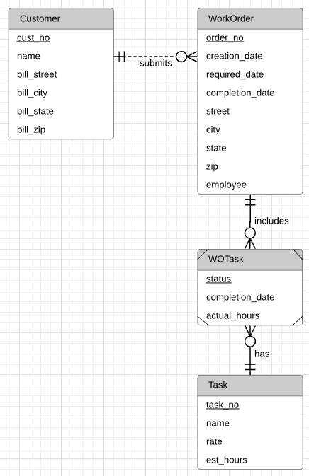
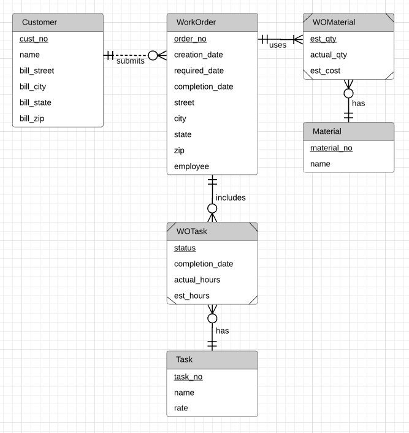
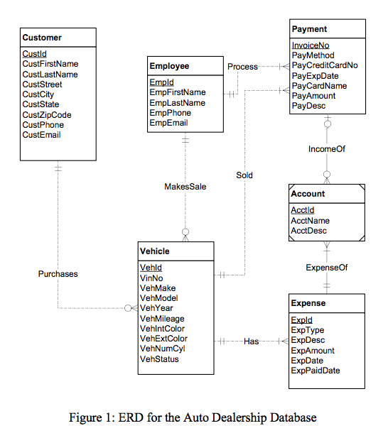
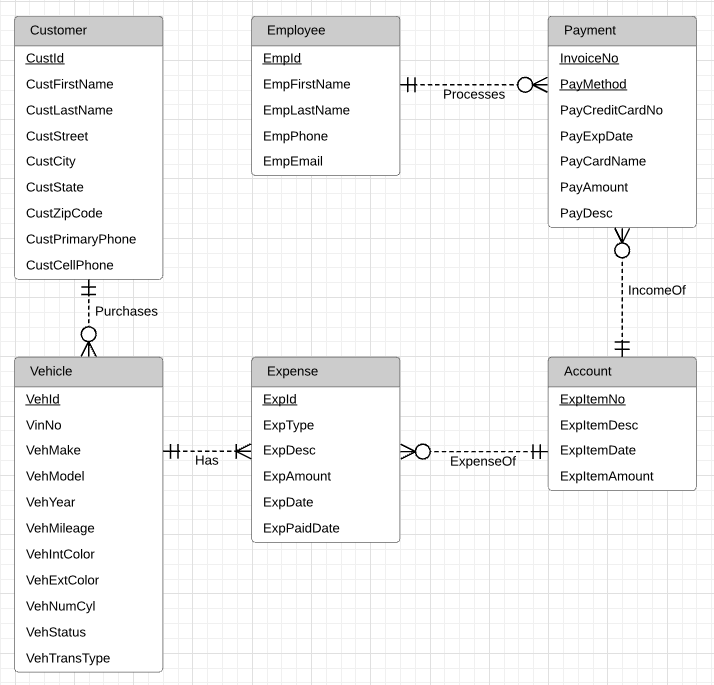

# Module 9

## Key Lessons

This module primarily taught:

1. How to model data from more complex narratives (create more complex ERDs)
2. When developing databases, revisions of the problem are very common, so learning to continuously revise our data model is a necessary skill.
3. Design errors are very difficult to detect to because they take into account the meaning of elements in an ERD, not just the diagram structure.

Because design errors can be difficult to detect and resolve, the following are good practices to follow when modelling your data:

- Documenting all points of inconsistency or incompleteness in the design document, allowing for systematic resolution by the end of designing.
- Design error checking throughout the document
- Documenting design justifications so there is clear communication about design decisions

## Practice Problems

### Problem 1a

For the following problem, define an ERD for the initial requirements and then revise the ERD for the new requirements. Your solution should have an initial ERD, a revised ERD, and a list of design decisions for each ERD. In performing your analysis, you may want to follow the approach presented in module 8.

The database supports the placement office of a leading graduate school of business. The primary purpose of the database is to schedule interviews and facilitate searches by students and companies. Consider the following requirements in your initial ERD:

- Student data include a unique student identifier, a name, a phone number, an e-mail address, a web address, a major, a minor, and a GPA. Students may attend multiple interviews.
- The placement office maintains a standard list of positions based on the Labor Department’s list of occupations. Position data include a unique position identifier and a position description. Because the position list is standardized, multiple companies may interview for the same position.
- Company data include a unique company identifier, a company name, and a list of positions and interviewers. Each company must map its positions into the position list maintained by the placement office. For each available position, the company lists the cities in which positions are available. 
- Interviewer data include a unique interviewer identifier, a name, a phone, an e-mail address, and a web address. Each interviewer works for one company. An interviewer may conduct multiple interviews.
- An interview includes a unique interview identifier, a date, a time, a location (building and room), an interviewer, and a student.

#### Design Decisions

Entities, attributes, and relationships are fairly straightforward from the problem statement, except for CPosLoc. This is an associative entity type used to facilitate the many-to-many relationship between company and positions. This weak entity contains the location of the company position by city and state so as to be unique for the company.

Cardinality among the relationships are also pretty straightforward as defined in the problem statement. A student may have 0 to many interviews lined up, but each interview is scheduled for exactly one student. An interviewer may have 0 to many interviews scheduled, and an interview has exactly one interviewer. However, an interview may be scheduled without the company deciding yet which interviewer to be assigned, so it may have no interviewer assigned at the time of scheduling. Of course, further collection of requirements are needed to know this for sure. An interviewer is employed at exactly one company at a time, and a company employs at least one interviewer. A company may offer many position locations, each associated with one position listing. In addition, positions may contain various locations for the same company, or for different companies.

All primary keys are indicated, with the CPosLoc table having a primary key that uses position_no, company_no, city, and state to be unique.

### Problem 1b

After reviewing your initial design, the placement office decides to revise the requirements. Make a separate ERD to show your refinements. Refine your original ERD to support the following new requirements:

- Allow companies to use their own language to describe positions. The placement office will not maintain a list of standard positions.
- Allow companies to indicate availability dates and number of openings for positions.
- Allow companies to reserve blocks of interview time. The interview blocks will not specify times for individual interviews. Rather a company will request a block of X hours during a specified week. Companies reserve interview blocks before the placement office schedules individual interviews. Thus, the placement office needs to store interviews as well as interview blocks.
- Allow students to submit bids for interview blocks. Students receive a set amount of bid dollars that they can allocate among bids. The bid mechanism is a pseudo-market approach to allocating interviews, a scarce resource. A bid contains a unique bid identifier, a bid amount, a student, and a company. A student can submit many bids and an interview block can receive many bids.

#### Design Decisions

Because a Position has been destandardized, it is now only specific to a company. The CompanyPos entity is still weak because by definition it depends on the company for the position to hold any meaning. The `date_opened` attribute indicates the date the position was opened, and `openings` has been added to indicate how many positions are available.

Entities added:

- InterviewBlock: This entity contains a start_time, end_time, and hours attribute to specify the number of hours, and time the block is open. The InterviewBlock is made by exactly one company, and may hold 0 to many interviews in the specified block (it may hold 0 because the interviewblock is specified before any interviews are scheduled). In addition, a Company may request 0 to many InterviewBlocks and an interview is scheduled for a specific InterviewBlock.

- Bid: The primary attribute is an amount of bid dollars associated with the Bid. A bid is created by only one student, but a student can create 0 or many bids. A bid is also submitted for a specific InterviewBlock, and InterviewBlocks may contain 0 or many bids.

In addition to these changes, a `bid_dollars` attribute has been added to the Student Entity because the problem statement clearly specifies that each student receive a set amount of bid dollars. With each bid that attribute is decreased.

### Problem 2

For the Expense Report ERD shown in Figure 1, identify and resolve errors and note incompleteness in the specifications. Your solution should include a list of errors and a revised ERD. For each error, identify the type of error (diagram or design) and the specific error within each error type. Note that the ERD may have both diagram and design errors. If you are using the ER Assistant, you can use the Check Diagram feature after checking the diagram rules yourself. Specifications for the ERD appear below:

- The Expense Reporting database tracks expense reports and expense report items along with users, expense categories, status codes, and limits on expense category spending.
- For each user, the database records the unique user number, the first name, the last name, the phone number, the e-mail address, the spending limit, the organizational relationships among users, and the expense categories (at least one) available to the user. A user can manage other users but have at most one manager. For each expense category available to a user, there is a limit amount.
- For each expense category, the database records the unique category number, the category description, the spending limit, and the users permitted to use the expense category. When an expense category is initially created, there may not be related users.
- For each status code, the database records the unique status number, the status description, and the expense reports using the status code.
- For each expense report, the database records the unique expense report number, the description, the submitted date, the status date, the status code (required), the user number (required), and the related expense items.
- For each expense item, the database records the unique item number, the description, the expense date, the amount, the expense category (required), and the expense report number (required).

#### Identified Errors

One issue with the diagram is the self-referencing relationship among users. The problem statement clearly specifies that users can have at most one manager, but can manage multiple users. The self-referencing relationship has therefore been corrected to a one-to-many relationship. In addition, the address attribute is missing for the user and has been added.

The relationship between the Expense Category and Users is a many-to-many relationship and the associative entity relationship UserECAmount has therefore been added with the `Limit` attribute representing the limit associated with the expense category. There may be 0 or many expense account limits created for different groups of users, but each expense account limit is associated with one ExpenseCategory. Last, each user must have at least one (to many) expense account limits.

There should not be a relationship between ExpenseReport and ExpenseCategory, as each ExpenseReport simply contains a list of ExpenseItems. However, a User can submit multiple ExpenseReports, and it therefore has been modified with a one-to-many relationship from the User Entity.

#### Resolved Design

## Graded Assignment

### Problem 1a

For the following problem, define an ERD for the initial requirements and then revise the ERD for the new requirements. Your solution should have an initial ERD, a revised ERD, and a list of design decisions for each ERD. In performing your analysis, you may want to follow the approach presented in module 9.

Design a database for managing the task assignments on a work order. A work order records the set of tasks requested by a customer at a specified location.

- A customer has a unique customer identifier, a name, a billing address (street, city, state, and zip), and a collection of submitted work orders.
- A work order has a unique work order number, a creation date, a date required, a completion date, a customer, an optional supervising employee, a work address (street, city, state, zip), and a set of tasks. 
- Each task has a unique task identifier, a task name, an hourly rate, and estimated hours. Tasks are standardized across work orders so that the same task can be performed on many work orders.
- Each task on a work order has a status (not started, in progress, or completed), actual hours, and a completion date. The completion date is not entered until the status changes to complete.

#### Design Decisions

The entities depicted with their associated primary keys are fairly straightforward. An associative entity WOTask has been created to facilitate the many-to-many relationship with WorkOrders and Tasks, as Tasks have been standardized. WOTask has its `status`, `task_no`, and `order_no` attributes which make up its primary key.

Cardinalities specified are all one-to-many. A customer can submit many work orders, but each work order is submitted on behalf of exactly one customer. In addition, a work order may contain many tasks, each associated with that specific work order.

### Problem 1b

After reviewing your initial design, the company decides to revise the requirements. Make a separate ERD to show your refinements. Refine your original ERD to support the following new requirements:

- The company wants to maintain a list of materials. The data about materials include a unique material identifier, a name, and an estimated cost. A material can appear on multiple work orders.
- Each work order uses a collection of materials. A material used on a work order includes the estimated quantity of the material and the actual quantity of the material used.
- The estimated number of hours for a task depends on the work order and task, not on the task alone. Each task of a work order includes an estimated number of hours.

#### Design Decisions

Because a list of materials are requested, the associative entity WOMaterial has been created to facilitate a many-to-many relationship between Material and WorkOrder. We have moved everything specific to a generic material into the Material entity such as the identifier and the name. We have moved the estimated quantity and estimated cost into the associative entity because both are also dependent on the Work Order itself. We have specified a minimum cardinality of one on the relationship from WorkOrder to WOMaterial because the problem statement specifies that every work order contains a collection of materials. However, we may need to do further analysis to determine if it is possible to schedule a work order that uses no materials, simply labor.

In addition, it has been further specified that the estimated number of hours for the task is now dependent on the work order in addition to the task itself, for that reason we have moved the `est_hours` attribute from Task to WOTask.

### Problem 2

For the Auto Dealership ERD shown in Figure 1, identify and resolve errors and note incompleteness in the specifications. Your solution should include a list of errors and a revised ERD. For each error, identify the type of error (diagram or design) and the specific error within each error type. Note that the ERD may have both diagram and design errors. Specifications for the ERD are presented in the following narrative.

Mountain High Quality Vehicles serves a metropolitan market with a medium size inventory of pre-owned cars and trucks. The vehicle inventory includes a variety of makes and models such as Acura, Chrysler, BMW, Cadillac, Ford, Chevrolet, Toyota, Honda, Mercedes-Benz, and more. A small staff manages the major functions of the business, purchasing, transporting, marketing, cleaning, maintaining, and selling the vehicles. They carefully inspect and certify the vehicles before they are available to the public for sale.

The dealership would like to develop an inventory management database to improve its tracking of vehicles, sales, and expenses.  The dealership also would like to track information about its customers and car(s) sold to its customers.

- Vehicle Acquisitions: Periodically the owners attend auctions and purchase pre owned cars seeking reasonable prices and quality vehicles. They also purchase pre-owned vehicles from the wholesale market. The purchased vehicles are transported to the dealership and inspected for mechanical problems. Each vehicle is fixed and cleaned before being placed for sale.
- Vehicle Improvements: Apart from purchases, the dealership has additional expenses to prepare vehicles for market. The expenses typically involve transporting the purchased vehicle to the dealership, checking the vehicle for any potential problem, repairs and maintenance if necessary, marketing and cleaning.
- Sales Details: Customers purchase vehicles at the dealership. Each sale involves one customer even for married couples. Although customers can purchase more than one vehicle, each vehicle is recorded as a separate sale. When a sale is completed, the employee associated with the sale and payments are recorded. Typically, vehicles remain on the lot for a period of time before sales occur.
- Vehicle Details: The database tracks the unique vehicle identifier and vehicle identification number (VIN) to complete a sales transaction. The database also tracks vehicle characteristics such as make, model, year, mileage, exterior and interior colors, transmission type (automatic or manual), and number of cylinders (4 or 6).
- Customer Details: The database records the unique customer number, first and last names, address, city, state, postal code, primary phone number, and cellphone number.
- Expense Details: Each vehicle expense has a unique expense identifier, expense type, expense description, expense amount, expense paid date, account, and associated vehicle.
- Account Details: The database tracks account details such as a unique account identifier, account description, related expenses, and related payments.
- Payment Details: The database also tracks the vehicle sale (payment process). Each payment has a unique invoice number and payment method. The payment options are cash, credit card, or external line of credit as no financing is available at the dealership. Typically one payment is made per sale although multiple payments are sometimes made if a customer provides cash for part of the sale. If a customer is paying with a credit card, the payment includes the credit card number, expiration date, name on the credit card, and payment description. The employee that completed the sales transaction and vehicle should be recorded. The same employee works as sales associate and processes the payment to complete the sale. Each payment is associated with one account for company accounting purposes.

#### Identified Errors

One issue is the Customer entity does not differentiate between the customer's cellphone number and primary phone number, `CustPhone` has therefore been changed to `CustCellPhone` and `CustPrimaryPhone`.

The Vehicle entity is missing an attribute specifying the transmission type, thus the `VehTransType` attribute has been added.

The Account entity is defined as a weak entity, although it does not depend on Expense or Payment entities, and has therefore been changed to a strong entity type.

The cardinalities specified from Expense to Account have been changed because an Account can have more than one expense, and an Expense has exactly one associated Account. However a newly created Account may have no expenses yet and so the minimum cardinality from Account to Expense is zero.

The problem statement clearly specifies that each Payment is associated with exactly one account, therefore the cardinality has been changed to a min and max of one from Payment to Account. The maximum cardinality from Account to Payment should also be many because an account can make multiple payments.

Because the customer can make multiple payments on the same invoice, the `PayMethod` attribute has also been added as part of the primary key for the Payment entity.

The problem statement does not specify any relationship between the employee entity and vehicle entity, nor the payment entity and the vehicle entity. Those relationships have therefore been removed.

The Employee entity specifies a minimum cardinality of one on the Payment entity. This has been changed to zero because if a newly hired employee does not make a sale or process any payments, they will not have a Payment.

#### Resolved Design

